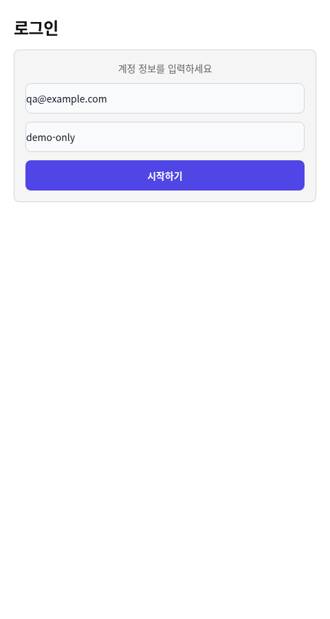

# 15. 로그인 전체 흐름 검증 기록

## 2026-10-05 인증 복구 후 재검증 — 실제 AI 전체 흐름 통과

**실제 Codex 생성 → GUI 4티켓 완료 → ZIP → 독립 앱 타입 검사·빌드·브라우저 표시를 통과했다.**
검증 코드는 develop `5670bfb2a9eec9df9a5c7ef7111e3bedd5dc7792`(#258·#259·문서 #260 포함)이다.
#217·#220의 실제 에이전트 완료 수용 조건을 충족한다. 아래 인증 실패와 수동 fixture는
이전 시도로 보존하며 이번 성공의 근거로 사용하지 않는다.

### 인증·GUI·실제 에이전트

사용자가 이 클라우드에서 시작한 `codex login --device-auth`를 완료했다. CLI는
`Successfully logged in`으로 종료했고 파일을 읽지 않는 최소 실제 모델 요청도 `AUTH_OK`를
반환했다. PC의 로그인이나 로그인 표시만으로 판정하지 않았다. CLI는
`codex-cli 0.159.0-alpha.3`, 실제 모델은 `gpt-6.1-sol`이다.

새 `/workspace/vsb-real-ai-authenticated-qa`에서 다음을 실행했다.

```bash
node /workspace/Visual-Spec-Builder/bin/visual-spec.mjs init
node /workspace/Visual-Spec-Builder/bin/visual-spec.mjs skills
cp /workspace/Visual-Spec-Builder/examples/login-screen.json .visual-spec/specs/login-screen.json
BROWSER=none node /workspace/Visual-Spec-Builder/bin/visual-spec.mjs
```

인자 없는 CLI와 스킬 7종 설치를 확인했다. Chromium에서 Login → File → Open으로
`login-screen.json`을 열고 LoginButton의 텍스트를 **시작하기**로 바꿔 Save했다.
디스크의 `pages.page1`은 기본 예제와 이 문구만 달랐다. **구현 티켓 → 전체 실행**으로
요청을 만들었으며 QA 스크립트는 생성 TSX나 성공 응답을 대신 작성하지 않았다.

인증 뒤 첫 호출은 설치 사본에 정본이 없고 하위 에이전트의 네트워크 조회가 막혀
두 티켓을 `failed`로 응답했다. 다음 시도는 로컬 정본·문서·실제 검증기 경로를 알려줬다.
이 실행은 자동 승인 심사에서 잠재적 비공개 소스 전송 우려로 한 번 거부됐다.
인증 없는 GitHub API의 `private: false`와 로컬 정본·검증기·계약 문서가 인증 없는 raw URL의
현재 공개 커밋과 바이트 단위로 일치한다는 증거를 제출해 재심사 승인을 받았다.
인증 값이나 사용자 비공개 자료를 복사하지 않았다.

이 시도는 Title·EmailInput 코드를 만들었지만 승인 대기와 지침 확인을 포함해 GUI의
**180초** 제한을 넘었다. GUI는 늦은 응답을 완료로 채택하지 않았다. 제한 시간을 늘리거나
낡은 응답의 ID를 바꾸지 않고 **새 GUI 요청**으로 재시도했다. 수동으로 실행한 Codex
한 프로세스가 각 새 요청의 한 웨이브만 처리하고 GUI가 다음 ID를 쓴 뒤 다음 웨이브를
처리하도록 했다. 제품의 수동 에이전트 실행 정책은 그대로다.

```bash
codex exec --sandbox workspace-write --skip-git-repo-check --ephemeral \
  -C /workspace/vsb-real-ai-authenticated-qa --color never \
  -o /tmp/vsb-real-ai-authenticated-evidence/three-wave-run/codex-final.txt - \
  < /tmp/vsb-real-ai-three-wave-prompt.txt
```

프롬프트는 설치된 ticket-response/to-react 스킬과 현재 요청의 경로·export·원자적 응답
계약을 지정했다. 읽기 전용 Codex 홈 초기화는 지원되는 실행 권한 승인으로 처리했고
내부 도구는 `workspace-write`를 유지했다. 마운트·인증 홈 변경이나 보호 우회는 없었다.
QA helper는 실제 `validateVisualSpec`으로 요청을 검사했으며 생성 코드나 응답은 쓰지 않았다.

| 웨이브 | 실제 GUI 요청 ID | 출력·GUI 결과 |
|---|---|---|
| 1 | `b9b3c5f4-316e-4d47-afaa-014ac526d6eb` | Title·EmailInput named export, 두 티켓 done |
| 2 | `f7dc8a95-d644-4179-a588-61215a41de04` | Card가 EmailInput 재사용, done |
| 3 | `d3fd273d-3aef-4f81-ac97-7ba6ebcba6d6` | Login default export가 Title·Card 조합, done |

각 요청은 같은 GUI 편집 결과를 담았고 실제 검증기는 `valid: true, issues: []`를 반환했다.
응답은 각 실제 request ID를 사용했다. 최종 GUI는 **4티켓 done, running false,
runError null**이었다. 설치 스킬 사본과 저장한 페이지도 AI 실행 뒤 그대로였다.

### ZIP·독립 앱

File → Export Code는 **파일 4개·티켓 4개 중 4개 포함·오류 0건**을 표시했다.
브라우저 harness가 버튼의 옛 이름을 찾아 실패한 뒤 같은 저장 문서를 다시 열고 실제
**결과 폴더 ZIP 내려받기** 버튼으로 `login.zip`을 다운로드했다. 제품 코드는 변경하지 않았다.
ZIP에는 `login/components/{Title,EmailInput,Card}.tsx`, `login/pages/Login.tsx`,
`login/package.json`, `login/README.md`가 있었다.

별도 `/workspace/vsb-real-ai-export-app`에 최소 Vite/React/TypeScript/Tailwind 앱을 준비하고
의존성을 독립 설치했다. 저장소 node_modules는 연결하지 않았다. React/React DOM 19.2.8,
TypeScript 5.9.3, Vite 8.2.1, Tailwind/`@tailwindcss/vite` 4.3.3을 사용했다.
ZIP의 TSX 네 파일을 **수정하지 않고** `src`에 넣어 생성 원본·ZIP·대상 파일의 SHA256을
대조했다. tsconfig의 strict 검사와 `include: ["src"]`가 실제 TSX를 포함한다.

```bash
corepack pnpm install --store-dir /workspace/.cache/pnpm/store
corepack pnpm run typecheck
corepack pnpm exec tsc -b --noEmit
corepack pnpm run build
corepack pnpm run preview
```

세 검사는 모두 exit 0이었다. production preview를 Chromium에서 열어 로그인 제목,
안내문·입력 두 개·**시작하기** 버튼을 확인했다. 두 입력 편집과 버튼 클릭도 수행했고
브라우저 런타임 오류는 0건이었다. 버튼은 높이 44px, 배경 `rgb(79, 70, 229)`, 흰 글자,
radius 8px였다. 실제 로그인 인증·비밀번호 마스킹은 스펙 범위 밖이다. Pretendard 설치,
픽셀 동일성, 실제 AI 자연어·이미지·반응형 출력까지 검증한 것은 아니다.

[요청 ID·응답 결과·ZIP/파일 해시·검사 기록](qa/2026-10-05-real-ai-login.json)과 아래 대상 앱
화면을 저장소에 남겼다. 원자료와 ZIP은 `/tmp/vsb-real-ai-authenticated-evidence/three-wave-run/`,
입력 작업공간과 독립 앱은 위 경로에 보존했다. 임시 경로는 영구 공유 링크가 아니다.
배포는 수행하지 않았다.

저장소 자체의 타입 검사·린트·전체 테스트·빌드·생성 타입 일치도 다시 확인했다.
**86파일 1,456테스트**가 통과했고 선택적 반응형 Chromium 1건은 기본 전체 테스트에서
건너뛰었다(같은 코드의 별도 실행 결과는 앞선 저장/rename 통합 QA 기록을 따른다).
스키마·Command/Ticket 계약이나 앱 소스는 이번 QA에서 변경하지 않았다.



## 2026-10-05 인증 복구 전 기록 — GUI 통과, 실제 AI는 인증 차단

이 절은 당시 실패 기록이다. 인증 복구 후 결과는 위 절을 따른다.

코드 기준은 develop `809b897390c9aa570479bfe48a3bae873cd09ac9`(#258·#259 포함)이다.
두 PR은 최신 HEAD의 로컬 검사·원격 CI와 병합 뒤 develop CI까지 통과했다.
타입 검사·린트·빌드·생성 타입 일치, 전체 86파일 1,456테스트를 확인했다.
저장/rename의 Chromium 회귀는 [저장 충돌](qa/tab-save-conflicts.md)과
[이름 변경 QA](qa/project-file-rename-qa.md)에 따로 적었다.

별도 쓰기 가능한 `/workspace/vsb-real-ai-qa`에서 실행했다.

```bash
node /workspace/Visual-Spec-Builder/bin/visual-spec.mjs init
node /workspace/Visual-Spec-Builder/bin/visual-spec.mjs skills
cp /workspace/Visual-Spec-Builder/examples/login-screen.json .visual-spec/specs/login-screen.json
BROWSER=none node /workspace/Visual-Spec-Builder/bin/visual-spec.mjs
```

CLI는 인자 없이 실행했고 스킬 7종을 설치했다. Chromium에서 Login 카드와
File → Open으로 파일을 연 뒤 LoginButton의 Content를 **시작하기**로 입력하고
File → Save했다. 실제 디스크 JSON과 캔버스 문구를 확인했다. **구현 티켓 → 전체 실행**은
Title·EmailInput을 요청했다. 첫 요청 ID는 `ea2bdaea-f1b8-424b-8691-07fd592b795c`,
네트워크 적용 후 새 GUI 실행의 요청 ID는 `e0a0a973-a9d6-491c-9c10-e70ba3fe7f8c`였다.
요청에는 편집한 버튼과 두 입력을 포함한 실제 현재 페이지가 들어 있었다.

기존 Codex 인증을 재사용했다. 기본 샌드박스의 읽기 전용 홈 때문에
`installation_id` 생성이 실패하는 것을 확인했고, 지원되는 실행 권한 승인 경로로
CLI 초기화를 통과시켰다. 인증 자료를 복사·출력하거나 홈/마운트를 변경하지 않았다.
에이전트 내부 도구는 계속 `workspace-write` 샌드박스를 사용했다.

```bash
codex exec --sandbox workspace-write --skip-git-repo-check --ephemeral \
  -C /workspace/vsb-real-ai-qa --color never \
  -o /tmp/vsb-real-ai-evidence/codex-wave1-final.txt -
```

실제 요청 한 웨이브를 티켓 응답 스킬과 to-react 지침으로 처리하도록 지시했다.
초기화 뒤 실제 모델 전송에서 `chatgpt.com/backend-api/codex/responses`의
WebSocket CONNECT가 **403**으로 거부됐다. HTTPS 폴백과 연결 대기도 진행됐으나
요청이 전송되지 않아 실행을 중단했다(exit 1, `turn interrupted`). 이는 2026-10-04의
모델 호출 전 읽기 전용 초기화 실패와 다른 차단 원인이다.

네트워크 설정 적용 후 chatgpt.com 응답은 200이 되었고 새 GUI 요청으로 재시도했다.
재시도 실행은 자동 승인 심사에서 프로젝트 스펙의 외부 전송 승인이 불충분하다는
이유로 먼저 거부됐다. 실제 요청의 `page`가 저장소 기본 로그인 예제와 버튼 문구
`시작하기`만 다름을 코드로 대조하고, 작업공간에 제품 스킬과 QA 파일만 있음을
확인한 근거를 제출하자 지원되는 재심사에서 실행이 승인됐다. 우회하지 않았다.

그 뒤 모델 WebSocket 요청은 **401 Unauthorized**를 반환했고 다음 오류로
에이전트가 exit 1로 종료됐다.

```text
Your access token could not be refreshed because you have since logged out
or signed in to another account. Please sign in again.
```

`codex login status`는 여전히 ChatGPT 로그인 상태를 표시했지만 실제 모델 요청은
인증되지 않았다. 로그인 표시를 준비 완료로 간주하지 않는다. 환경에 기존 Codex
인증을 다시 연결한 뒤 새 GUI 요청으로 재검증해야 한다. 추가 API 키 요구를 만들거나
인증 값을 채팅·파일·로그에 복사하지 않았다.

두 시도 모두 생성 TSX **0개**, 티켓 완료 **0개**였다. File → Export Code는
**파일 0개·4티켓 중 0개 포함·오류 4건**을 표시했고 ZIP을 만들지 못했다.
성공 응답이나 생성 파일을 수동 주입하지 않았다. 실제 AI 결과의 별도 앱 타입 검사·빌드·
브라우저 표시는 **미실행**이며 #217·#220은 완료하지 않는다. GUI 브라우저 오류는 0건이었다.

환경 설정 초안에 `api.github.com`과 실제 모델 호출에 필요한 `chatgpt.com`을 추가했다.
GitHub API/CI/정상 머지는 동작했고 chatgpt.com 접근도 후속 요청에서 확인됐다.
초안 저장만으로 실행 정책 적용이나 환경 게시를 입증한 것은 아니다. 마지막 외부
차단 요인은 네트워크가 아니라 기존 Codex 인증 갱신 실패다. 인증 재연결 후 실제
요청부터 재시도해야 하며 자격 증명 값이나 가상의 AI 성공을 요구하지 않는다.

마지막 요청·에이전트 로그·GUI 상태·스크린샷은 `/tmp/vsb-real-ai-evidence/`에 있고,
앞선 CONNECT 403 시도는 `/tmp/vsb-real-ai-network-blocked-evidence/`에 따로 보존했다.
입력 작업공간은 `/workspace/vsb-real-ai-qa`에 남겼다. 임시 경로는 영구 공유 링크가 아니다.
아래 2026-10-04 기록의 수동 fixture 성공은 이번 실제 AI 검증을 대신하지 않는다.

## 2026-10-04 기록


검증일: **2026-10-04**. 관련 이슈: #217·#218·#220·#221·#228·#230·#231·#233.

**실제 GUI 편집·저장은 통과했지만, 외부 Codex가 환경 초기화 단계에서 실패하여 실제 AI를 포함한 전체 흐름은 완료하지 못했다.** 아래 수동 fixture 검증은 파일 교환·Export·대상 앱 통합을 따로 확인하며 AI 생성 성공을 의미하지 않는다. #217의 실제 에이전트 완료 판정과 #220은 열린 검증 항목으로 남긴다.

## 검증 기준

- 원격 `develop`: `5b0af2cc0b8ec8af2438a1cfda92a402438c5e5f` (#216 포함).
- 통합 실행 코드: `bad0240c81a74d46812093dcdf700f05ab5f362f`.
- 자동 검사: 가이드까지 포함한 `1d89835`에서 실행. 이후 변경은 이 QA 기록과 구현 현황 문서뿐이다.
- 통합한 독립 Draft PR: [#237](https://github.com/visual-spec-labs/Visual-Spec-Builder/pull/237) (`45409535`), [#238](https://github.com/visual-spec-labs/Visual-Spec-Builder/pull/238) (`0b0970e9`), [#239](https://github.com/visual-spec-labs/Visual-Spec-Builder/pull/239) (`49ab9352`), [#240](https://github.com/visual-spec-labs/Visual-Spec-Builder/pull/240) (`101af37c`).
- 각 PR의 내용을 로컬 통합 브랜치에 cherry-pick했다. 원격 develop에 병합된 상태라는 뜻은 아니다. 통합 PR은 이 네 PR에 의존한다.
- 환경: Linux, Node `24.19.0`, pnpm `10.33.0`, Chromium `/usr/bin/chromium`, Python Playwright. 원격 CI는 Node 20에서 네 독립 PR 모두 통과했다.

## 자동 검사 — 통과

저장소 `/workspace/vsb-delivery`에서 실행했다. 이 환경에서는 pnpm 실행 파일 대신 `COREPACK_HOME=/tmp/vsb-corepack corepack pnpm`을 사용했다.

```bash
pnpm install --frozen-lockfile
pnpm run typecheck
pnpm test
pnpm run lint
pnpm run build
pnpm run generate:types
git diff --exit-code
```

통합 결과: **68파일 1,239테스트 통과**, 나머지 명령 exit 0. build에는 Vite의 향후 native config loader와 확장자 없는 import 관련 경고가 있었으나 현재 빌드는 성공했다. 생성 타입 변경은 없었다.

독립 PR별 전체 테스트는 #237 68파일/1,237개, #238·#239 67파일/1,234개, #240 67파일/1,236개다. 수치를 더한 것이 아니라 통합 브랜치에서 전체를 다시 실행했다. #240은 별도 Chromium 검증으로 활성 세그먼트·균등 배치 반복의 빈 Undo 방지, 무효 hex의 불투명도 비활성 및 색상 복구, 무효 스펙 Export 알림과 정상 다운로드도 확인했다. Export 오류는 무효 상태를 주입한 조건부 재현이며 일반 GUI 입력으로 그 상태를 만드는 경로까지 입증한 것은 아니다.

## 실제 CLI·GUI — 편집·저장 통과

빈 `/tmp/vsb-e2e-project`에서 다음 명령을 실행했다. 설치 명령의 결과는 작업공간 네 폴더 생성과 스킬 일곱 종 복사였다.

```bash
node /workspace/vsb-delivery/bin/visual-spec.mjs init
node /workspace/vsb-delivery/bin/visual-spec.mjs skills
cp /workspace/vsb-delivery/examples/login-screen.json .visual-spec/specs/login-screen.json
BROWSER=none node /workspace/vsb-delivery/bin/visual-spec.mjs
```

서버는 `http://localhost:5173/`에서 시작했다. `visual-spec gui`라는 하위 명령은 사용하지 않는다. 패키지는 private이므로 공개 npm 패키지 설치 성공을 가정하지 않았다.

Chromium에서 홈의 Login을 선택한 뒤 **File → Open**에 `login-screen.json`을 입력했다. 실제 File Open 경로로 7개 노드와 입력 두 개·버튼이 표시됐다. `LoginButton`을 선택해 Content의 텍스트를 `로그인`에서 `시작하기`로 바꾸고 **File → Save**했다. 캔버스 문구와 `.visual-spec/specs/login-screen.json`의 버튼 content가 모두 바뀌었음을 확인했다. 이 경로는 스토어에 예제를 주입한 검증이 아니다.

**구현 티켓 → 전체 실행**은 첫 웨이브 `Title`·`EmailInput`을 요청했다. 실제 요청 ID는 `19b23384-2423-4dc6-a8ca-4a236b49f364`였고, `filePath`는 `components/Title.tsx`·`components/EmailInput.tsx`였다. EmailInput은 두 입력 노드 인스턴스를 공유한다.

## 실제 외부 AI — 환경 차단

`codex login status`는 ChatGPT 로그인 상태로 보고했으나 이것만으로 실행 성공을 판정하지 않았다. 새 티켓 응답 스킬과 그 매핑 지침을 읽고 현재 요청을 처리하라는 프롬프트를 표준 입력으로 전달했다.

```bash
codex exec --sandbox workspace-write --skip-git-repo-check --ephemeral \
  -C /tmp/vsb-e2e-project --color never \
  -o /tmp/vsb-e2e-evidence/codex-final.txt -
```

결과는 **exit 1**, 모델 호출 전에 다음 오류로 종료됐다.

```text
WARNING: proceeding, even though we could not create PATH aliases: Read-only file system (os error 30)
Error: failed to initialize in-process app-server client: Read-only file system (os error 30)
```

`findmnt -T /workspace/.codex -o TARGET,FSTYPE,OPTIONS`는 해당 경로가 `tmpfs ro` 마운트임을 확인했다. 마운트 권한·인증 자료를 변경하지 않았다. Claude Code 실행 파일도 이 환경에 없었다.

실제 실행 결과는 생성 파일 0개, GUI Export 검사에서 4티켓 모두 누락·오류 4건, ZIP 다운로드 비활성 상태였다. 실제 AI 생성, 전체 티켓 완료, 그 AI 결과의 컴파일·브라우저 검증은 **미완료**다. 티켓 응답을 손으로 성공으로 바꿔 이 시도를 완료 처리하지 않았다.

## 수동 fixture 경로

이 절은 별도 작업공간에서 작성한 수동 응답의 검증 결과를 기록한다. 외부 AI의 스킬 이해·생성 품질·인증된 호출을 검증하는 것은 아니다.

작업공간 `/tmp/vsb-fixture-project`에서 같은 CLI로 init·무인자 GUI 실행을 수행하고 앞선 실제 GUI Save 결과를 복사했다. 수동 작성한 React 파일 네 개를 **해당 웨이브가 요청될 때만** generated에 쓰고, 실제 request ID를 사용한 응답을 기록했다.

| 순서 | GUI가 보낸 티켓 | 관찰 결과 |
|---|---|---|
| 1 | Title, EmailInput | 두 component 파일과 해당 ID의 응답을 수용 |
| 2 | Card | 앞선 입력 component를 참조하는 파일과 새 ID의 응답을 수용 |
| 3 | Login | Title·Card를 조합하는 page 파일과 새 ID의 응답을 수용 |
| 최종 | 네 티켓 | 모두 done, running false, error null |

File → Export Code는 **파일 4개·티켓 4개 포함·오류 0건**을 표시했다. 버튼으로 `login.zip`을 실제 다운로드했고, 압축 안에서 `login/components/{Title,EmailInput,Card}.tsx`, `login/pages/Login.tsx`, `login/package.json`, `login/README.md`를 확인했다.

별도 `/tmp/vsb-fixture-target`에 수동 구성한 최소 Vite/React/TypeScript/Tailwind 앱을 만들고 ZIP의 코드를 `src` 아래에 복사했다. `pnpm create vite` 템플릿 사용을 주장하지 않는다. 저장소 node_modules를 링크하지 않고 별도로 pnpm 설치했다. 버전은 React/React DOM 19.2.8, Vite 8.2.1, TypeScript 5.9.3, Tailwind/`@tailwindcss/vite` 4.3.3이었다.

```bash
# /tmp/vsb-fixture-target
pnpm install --store-dir /tmp/vsb-pnpm-store
pnpm run typecheck
pnpm exec tsc -b --noEmit
pnpm run build
pnpm run preview
```

타입 검사(`tsc --noEmit` 및 `tsc -b --noEmit`)와 production build는 exit 0이었다. ZIP의 TSX 네 개는 변경하지 않았으며 SHA256 일치를 확인했다. 이 대상 앱은 `include: ["src"]`가 있는 단일 tsconfig이므로 타입 검사가 실제 TSX를 포함한다. 빈 `files: []`와 references만 있는 구성에서 `tsc --noEmit`이 아무 파일도 검사하지 않는 #188의 함정과 구분한다.

빌드 결과를 preview `http://127.0.0.1:5191`에서 열어 로그인 제목·두 입력·`시작하기` 버튼과 입력 조작을 확인했다. 브라우저 런타임 오류는 없었고 버튼의 실제 CSS는 높이 44px, 배경 `rgb(79, 70, 229)`, 흰 글자였다. Pretendard 설치나 모든 픽셀의 동일성은 확인하지 않았다. 이 예제에는 이미지가 없고 실제 로그인 인증·비밀번호 마스킹은 검증 범위가 아니다.

별도 NL 수동 응답 검사에서는 실제 GUI 요청 후 현재 request ID로 `Card.layout.gap`을 24로 바꾸는 Command 응답을 썼다. gap **12 → 24**, history past 1을 확인했고, Undo **24 → 12**(past 0/future 1), Redo **12 → 24**(past 1/future 0)를 확인했다. 이 응답도 AI가 생성한 것은 아니다. NL 변경 후 코드를 다시 생성해 Export한 결과라는 뜻은 아니다.

fixture의 요청·응답·스크립트·ZIP·검사 로그·화면 캡처는 `/tmp/vsb-fixture-evidence/`에 보관했다. 파일 교환과 앱 통합 가능성은 확인했으나 새 티켓 스킬의 실제 AI 동작은 앞 절의 환경 차단으로 여전히 미검증이다.

## 2026-10-04 당시 남았던 완료 조건

쓰기 가능한 정상 Codex 또는 Claude Code 실행 환경에서 [사용 가이드](14-getting-started.md)를 따라 새 작업공간으로 실제 시도를 재실행한다. 요청된 파일을 에이전트가 생성하고 세 웨이브의 네 티켓이 완료되는지, ZIP을 대상 React/TypeScript/Tailwind 앱에 넣어 타입 검사·빌드·브라우저 표시까지 되는지 확인해야 #217·#220의 실제 에이전트 완료 판정을 충족한다. #219의 프로세스 정책은 [수동 실행·안내 유지로 결정](02-mvp-scope.md#에이전트-실행-정책-219-2026-10-04)됐으며, 이 QA가 실제 AI 실행 성공을 입증한다는 뜻은 아니다. 다중 탭 충돌(#232) 역시 이 검증의 해결 범위가 아니다.

임시 원자료는 이 클라우드 실행 환경의 `/tmp/vsb-e2e-evidence/`에 요청 JSON·실행 로그·화면 캡처·결과 JSON으로 남겼다. 이 경로는 다른 체크아웃에서 접근할 수 있는 영구 링크가 아니므로 판단에 필요한 명령·오류·결과를 본문에도 기록했다.
