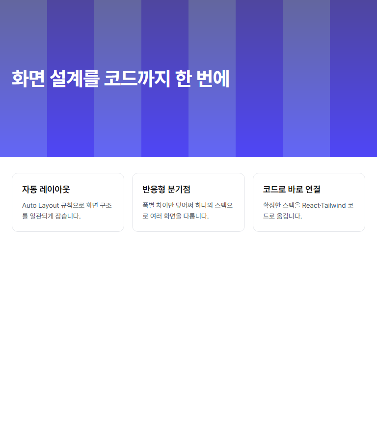

# 28. 실제 사용자 흐름 회귀와 실제 모델 실행 (#292)

여러 단계를 이은 사용자 여정과 실제 AI 결과를 어떻게 검증하는지 한 곳에 정리한다. 개별 결함의 국소 회귀는
각 이슈가 책임지고, 이 문서는 단계를 연결한 여정과 실제 모델 실행 기록을 책임진다.

## 1. 검증 구분 — fixture 성공을 실제 모델 성공으로 쓰지 않는다

| 구분 | 실행 위치·비용 | 확인하는 것 | 확인하지 않는 것 |
|---|---|---|---|
| **fixture 사용자 여정** | 필수 CI Chromium 잡(`run-journeys.sh`, 8개). 모델 비용 없음 | 실제 Chromium·Vite HTTP·작업공간 파일로 GUI 조작, 요청/응답 프로토콜, 상태 전이, 다운로드 | 모델이 만든 Command·TSX의 품질. 응답과 TSX는 스크립트가 쓴 결정적 fixture다 |
| **fixture 실측** | `layout-parity.mjs` 기본 모드(수동, 폰트 CDN 필요) | 계약을 따른 손 작성 생성 코드가 GUI와 같은 배치인지([25](25-layout-parity-contract.md)) | 실제 AI 출력의 배치 |
| **실제 모델 실행** | 수동(`real-model-journey.mjs`). 이 기기의 인증된 Claude Code/Codex를 쓰며 **비용이 든다**. CI에서 실행하지 않는다 | 실제 모델이 만든 Command·TSX가 GUI 검증·재생성 보호·Export·독립 앱·실측을 통과하는지 | 기록한 SHA·CLI·모델 밖의 조합. 다른 모델·버전의 성공을 보증하지 않는다 |

규칙:

- CI 로그의 `PASS all 8 fixture journeys`는 fixture 결과다. PR·이슈에 "실제 모델 통과"로 적지 않는다.
- 실제 모델 결과는 4절처럼 **통합 커밋 SHA·CLI 버전·모델·명령·소요 시간**과 함께 기록하고, 해당 조합에만 쓴다.
- 중간 실패·재시도·권한 거부도 기록한다. 실패를 성공 기록으로 덮지 않는다.

## 2. fixture 사용자 여정 (CI 필수)

준비(Node Playwright 1.62.0·Chromium·`PLAYWRIGHT_MODULE`)는 [사용자 여정 문서](qa/user-journey-regression.md#비용-없는-독립-실행)를 따른다.

```bash
FORCE_COLOR=1 bash scripts/browser/run-journeys.sh   # 마지막 줄: PASS all 8 fixture journeys (no skips)
```

| #292 완료 조건 1 항목 | 여정(스크립트) | 단언 요약 |
|---|---|---|
| 편집 직후 문서 전환 | `document-transitions.mjs` | 편집한 문서에서 New/Open/홈 카드 전환 확인·취소, 교체 요청, 두 탭 저장 충돌, 늦은 응답 ABA |
| 〃 + 낡은 티켓 | `stale-ticket-journey.mjs` 4단계 | 편집 직후 다른 문서를 Open하고 돌아와도 이전 티켓 계획은 전달 불가, 요청 파일을 쓰지 않음 |
| 낡은 티켓 | `stale-ticket-journey.mjs` 1~3단계 | 컴포넌트 웨이브 응답 대기 중 레이어 숨김 → 받은 결과는 `done`, 페이지 웨이브 요청 없음, 전달 버튼 비활성. Undo로 전달 가능·Redo와 페이지 전환으로 다시 막힘. 다시 생성 → 전체 웨이브 → Export **현재**, 이후 편집 → 페이지 티켓 **오래됨** |
| Export 페이지 전환 | `export-journey.mjs` | 검사 결과·다운로드 무효화, Beta 재검사, 문서 신원·history 보존 |
| 다중 탭 요청 | `request-generation.mjs` | 대기 연장·중지·재시도, 두 탭에서 lease 만료/취소/재컴파일 뒤 늦은 A의 PUT 거부, B의 바이트·manifest 유지 |
| 〃 (저장) | `project-dialogs.mjs`·`document-transitions.mjs` | 두 번째 탭 저장 충돌 대화상자, 초안·history 보존 |
| 자산 실패 | `export-journey.mjs` | 검사 후 자산 삭제 → 다운로드 차단·누락 표시 → 복구·재시도 ZIP의 실제 바이트 |
| 재생성 보호(#282) | `manual-change-guard.mjs` | 실제 확인 UI, 취소·재시도, BOM/CRLF 백업, 되돌리기 |

`stale-ticket-journey.mjs`는 #292에서 새로 만들었고, `request-generation.mjs`·`manual-change-guard.mjs`는 기존 스크립트를
필수 묶음에 연결했다. 페이지 티켓은 화면 전체가 입력이라 편집 뒤 반드시 **오래됨**이다. 컴포넌트 티켓은 #281의
컴포넌트 단위 지문에서는 **현재**로 남을 수 있어 전체 판정은 `stale`/`partial` 둘 다 허용한다.

넣지 않은 스크립트: `recovery-provenance.mjs`(Windows에서 저장 충돌 대화상자에 막혀 실패, 5절),
`editing-context.py`·`property-guidance.py`(외부에서 띄운 서버 계약), `layout-parity*.mjs`(폰트 CDN 필요),
`real-model-journey-fake.mjs`(아래, 수동).

### 실제 모델 도구 자체의 무비용 회귀 (PR #358 리뷰)

3절의 도구가 실패를 성공으로 덮지 않는지 모델 없이 확인한다. 모두 가짜 CLI이며 **실제 모델 결과가 아니다**.

| 검사 | 실행 | 확인하는 것 |
|---|---|---|
| `test/real-model-agent.test.ts` | `pnpm test`(필수 CI의 Linux·Windows 잡) | 셸 없는 실행 계획(POSIX는 argv 그대로, Windows는 `.exe` 직접·`.cmd`만 `cmd.exe /d /s /c`), `Bash(node:*)`·공백 경로·따옴표·메타문자·한글·`%PATH%`·끝 역슬래시 인자와 stdin의 원문 보존(Windows는 공백 경로의 npm식 `.cmd`, POSIX는 실행 스크립트를 각 OS 잡에서 실측), 시작 실패·종료 코드·signal 실패와 stderr 기록, 자연어·티켓 성공 판정 |
| `test/layout-parity-names.test.ts` | `pnpm test` | 공백·한글·자식과 같은 이름·일반 이름에서 Export와 같은 `pages/<componentName>.tsx`를 실제로 고르는지 |
| `real-model-journey-fake.mjs` | 수동 Chromium(폰트 CDN 불필요) | `real-model-journey.mjs`를 실제 명령으로 실행해 exit 1·응답 없음·이전 requestId·오류 응답·GUI 적용 거부·미완료 티켓은 **종료 코드 1**, 정상 완료는 0. `Design (v2`·`A.B`·`A*B`와 유사 이름 카드(`Design (v2)`·`AxB`·`AAAB`, 같은 이름 `Twin` 2개) 중 요청한 문서만 바뀌는지 |

```bash
node scripts/browser/real-model-journey-fake.mjs   # 마지막 줄: PASS argv·stdin 원문 보존 …
```

## 3. 실제 모델 실행 절차 (수동, 비용 있음)

준비: 에이전트 CLI 하나를 설치·로그인하고 **실제 모델 요청이 되는지** 먼저 확인한다(로그인 표시만으로 판정하지 않는다).
새 계정·키를 만들지 않는다. 부모 셸에 다른 `ANTHROPIC_API_KEY` 등이 있으면 구독 로그인보다 앞서므로, 도구는
`ANTHROPIC_*`·`CLAUDE_CODE_*` 변수를 자식 프로세스에 넘기지 않는다. 인증 값은 기록하지 않는다.

`scripts/browser/real-model-journey.mjs`가 사용자 대신 GUI를 Chromium으로 조작하고, GUI가 보여 주는 지시문
(`agentHandoff.ts`) **그대로** 에이전트를 비대화형으로 실행한다. 응답·생성 파일은 에이전트만 쓴다. 에이전트가 도는 동안
GUI의 **대기 연장**을 눌러 같은 요청의 기한만 미룬다. 단계마다 `<root>/evidence/log.jsonl`에 요청 ID·응답·소요를 남긴다.

```bash
ROOT=/tmp/vsb-real            # 저장소 밖의 새 폴더
VSB_REPO="$PWD"               # 저장소 루트에서 실행한다
J="node scripts/browser/real-model-journey.mjs"
$J setup --root $ROOT         # init → skills → assets/hero.png 배치, 버전 기록
# 별도 터미널: GUI를 띄우고 주소를 확인한다(인자 없음)
(cd $ROOT/ws && BROWSER=none node "$VSB_REPO/bin/visual-spec.mjs")
R="--root $ROOT --url http://localhost:5173/ --card Untitled"   # 홈 카드는 spec.name을 보인다

$J draft --root $ROOT --url http://localhost:5173/ --instruction "<로그인 화면 설명>"   # 홈 → 자연어 초안 → 요청 → Save as
$J add-page $R
$J nl $R --page "Page 2" --instruction "<반응형 페이지 설명>"
$J edit $R --page Login --node LoginButton --field 텍스트 --value 계속하기
$J tickets $R --page Login        # 구현 티켓 → 에이전트에 전달 → 웨이브마다 실제 에이전트
$J tickets $R --page Landing
$J edit $R --page Login --node Title --field 텍스트 --value "<새 제목>"   # 생성 뒤 GUI 수정
$J touch $R --file real-flow/page1/pages/Login.tsx                      # 생성 파일 수동 수정(#282)
$J tickets $R --page Login --overwrite backup   # 덮어쓰기 확인이 뜨면 모두 백업 후 덮어쓰기
$J export $R --page Login         # Export Code 검사 → 결과 폴더 ZIP 내려받기
$J export $R --page Landing
```

`--agent codex`는 `codex exec --sandbox workspace-write`로 같은 지시문을 넘긴다. `--model`로 모델을 고정할 수 있다.
PATH 밖의 실행 파일은 `--agent-bin <경로>`로 지정한다(인자 형식은 `--agent`가 정한다). 어느 OS에서도 셸을 거치지 않는다 —
POSIX는 실행 파일과 argv를 그대로, Windows는 PATH×PATHEXT로 찾은 `.exe`를 그대로, npm 실행기(`.cmd`)만 인자를 escape해
`cmd.exe /d /s /c`로 실행한다. 지시문은 항상 stdin이다. `--card`(없으면 `--doc`)는 프로젝트 이름과 **글자 그대로 같은**
홈 카드 하나만 연다. 없거나 여러 개면 실패한다.

**단계 실패와 종료 코드.** 아래 중 하나면 그 단계는 `log.jsonl`에 `error`·`details`(실패 단계, 종료 코드, signal, stderr 끝)를
남기고 **종료 코드 1**로 끝난다. 다음 단계로 넘어가기 전에 확인한다.

- 에이전트 시작 실패, 0이 아닌 종료 코드, signal 종료, Claude 결과의 `is_error`.
- `draft`·`nl`: 에이전트가 끝났는데 `nl-response.json`이 없거나 깨졌거나 이번 requestId가 아님, 오류(`error`) 응답,
  GUI가 60초 안에 적용(되돌리기 표시)하지 않음·거부·배경 변경 확인 대기(자동 승인하지 않는다). GUI가 아직 응답을
  기다리고 있으면 **취소**를 눌러 요청 잠금을 풀고 끝낸다(다음 단계가 30초 잠금 만료에 막히지 않는다).
- `tickets`: 모든 웨이브가 끝나지 않음(`running`), `runError`, 대상 티켓 중 `done`이 아닌 것, 다음 웨이브 요청 대기(30초)·
  응답 수용 대기(120초)·웨이브 수(8) 상한 도달. `--overwrite cancel`로 덮어쓰기를 취소해도 티켓이 끝나지 않으므로 실패로 남는다.
Claude Code는 `--permission-mode acceptEdits --allowedTools "Bash(node:*)" --setting-sources project`로 실행한다.
사용자 전역 플러그인·훅을 싣지 않고, 작업공간 밖 쓰기와 셸 명령 대부분은 권한 거부로 남는다(4절 거부 수).

ZIP 이후는 셸에서 직접 한다.

1. 저장소와 별도 폴더에 Vite + React + TypeScript + Tailwind v4 앱을 만들고 의존성을 독립 설치한다.
2. ZIP을 풀어 `pages/`·`components/`·`assets/`를 **수정 없이** 페이지별 폴더(예: `src/visual-spec/login/`)에 넣고
   ZIP과 대상 파일의 SHA-256을 대조한다. 같은 프로젝트의 여러 페이지 ZIP은 최상위 폴더 이름과 컴포넌트 경로가 겹칠 수 있다(5절).
3. `tsc -b --noEmit`(생성 TSX가 `include`에 들어가는지 `--listFiles`로 확인), `tsc -b && vite build`, `vite preview`.
4. preview를 Chromium으로 열어 페이지마다 런타임 오류·이미지 로딩·root 크기·반응형 폭을 확인하고 화면을 남긴다.
5. GUI 대비 실측: 저장한 스펙과 ZIP을 푼 폴더로 잰다. 고정 폭은 `screen.size`, 반응형은 모든 분기점 직전·경계·직후와
   360px·기준 폭이다. 판정·무효 기준은 [25](25-layout-parity-contract.md) 2절이다. `--case`와 보고서 `case`는 스펙의
   page 이름(표시 이름)이고, 생성 파일은 Export와 같은 page 티켓 `componentName`(`pages/<이름>.tsx`, 보고서 `pageFile`)으로
   고른다. `--generated-url`의 `{page}`에도 이 `componentName`이 들어간다([25](25-layout-parity-contract.md) 3절).

```bash
node scripts/browser/layout-parity.mjs --spec $ROOT/ws/.visual-spec/specs/real-flow.json \
  --generated-dir <ZIP을 푼 폴더>/untitled --case Login --out parity-login.json
```

저장소에는 요약 기록(JSON)·실측 원자료·최종 스펙·원본 TSX·화면을 남긴다. `/tmp` 경로만으로 증거를 삼지 않는다.

## 4. 2026-10-10 실행 기록 (실제 모델)

원자료: [실행 기록](qa/2026-10-10-real-model-journey.json) · [최종 스펙](qa/2026-10-10-real-model-spec.json) ·
[생성 원본](qa/2026-10-10-real-model-output/) · 실측 [Login](qa/2026-10-10-real-model-parity-login.json)·[Landing](qa/2026-10-10-real-model-parity-landing.json).

**통합 빌드(로컬 전용, push 안 함)**: `qa/292-integration` = develop `2b0099c90ac82bacb5738d18239a9ddab913ebb5`
(#280 PR #350·#284 PR #349·#282 PR #353·#290 PR #354 병합 상태) + #281 `24743d9a2739109aa49549d7a25bb6b67b7780fd`
병합 커밋 `6c993672d82ea158b3d545fed4f6a42528f5c708`. 제품 소스는 이 커밋 그대로이고, QA 스크립트
(`real-model-journey.mjs`, `layout-parity.mjs`의 `--spec`)만 이 PR 브랜치의 것을 복사해 실행했다.
**이 절의 실제 모델·독립 앱·0px 실측은 모두 이 통합 커밋의 결과이며 PR #358 HEAD를 재실행한 결과가 아니다.** 실행에 쓴 QA
스크립트도 리뷰 반영(실패 전파·셸 없는 실행·파일명·카드 이름) 전 판이다. 리뷰 반영 뒤에는 실제 모델을 다시 실행하지 않았고,
도구 변경은 2절의 무비용 회귀(가짜 CLI)로만 확인했다.

**환경**: Windows 11 Home(ko-KR), Node 24.12.0, pnpm 10.33.0, Playwright 1.62.0의 Chromium 151.0.7922.34(headless shell),
**Claude Code 2.1.288, 모델 `claude-opus-5-5`(CLI 기본값)**, 기존 구독 로그인. 에이전트 14회 실행, 합계 약 25분.

| 단계 | 실행 | 결과 |
|---|---|---|
| 1. 자연어 생성 — Login | 홈 → 자연어로 초안 만들기 → 요청. "390×844, 맨 위 `assets/hero.png`(높이 200), 제목·입력 2개·로그인 버튼" | 43초, Command 8개. GUI가 검증 후 적용("노드 6개를 추가했습니다, 화면 설정 2개를 바꿨습니다"). `real-flow.json`으로 Save as |
| 2. 페이지 추가 | 레이어 트리 **새 페이지** → Save | `page-1`(Page 2) |
| 3. 자연어 생성 — Landing(반응형) | "1440×900, hero.png 배경 히어로·흰 제목, 카드 3개, tablet ≥768 가로, desktop ≥1024 여백 64" | 85초, Command 15개(노드 12·화면 설정 3). `updateScreen responsive`로 분기점·재정의 생성 |
| 4. GUI 수정(생성 전) | LoginButton 텍스트 → "계속하기" | 저장 |
| 5. 코드 생성 — Login | 구현 티켓 → 에이전트에 전달, 3웨이브 | 79/165/87초, 4티켓 `done`, runError 없음 |
| 6. 코드 생성 — Landing | 〃 | 145/103/116초, 4티켓 `done`. #281로 `page1/components/Hero.tsx`와 `page-1/components/Hero.tsx`가 따로 생성 |
| 7. GUI 수정(생성 뒤) | Login Title → "팀 공간에 로그인", Landing HeroTitle → "화면 설계를 코드까지 한 번에"(편집 기준을 기본값으로) | 저장, 반응형 재정의 유지 |
| 8. 생성 파일 수동 수정 | `real-flow/page1/pages/Login.tsx` 끝에 주석 한 줄 | `887e319f…` → `c8d712eb…` |
| 9. 재생성 — Login(#282) | 다시 전달, 3웨이브(178/149/105초) | 3웨이브에서 **덮어쓰기 전 확인**: `Login.tsx` 1개만 "수동 변경됨". 모두 백업 후 덮어쓰기 → 백업은 수동 수정본(`c8d712eb…`)과 같음. 바뀐 파일 `Login.tsx`·`Content.tsx`(새 제목) |
| 10. 재생성 — Landing | 3웨이브(104/72/79초) | 확인 없음(수동 변경 없음). 바뀐 파일 `Hero.tsx`(새 제목) |
| 11. Export | 페이지마다 File → Export Code → ZIP | 둘 다 파일 4개·티켓 4/4·오류 0·생성 세대 **현재**. ZIP SHA-256 Login `c92a84a9…`, Landing `bc93a9a4…` |

권한 거부: Claude Code가 작업공간 밖 임시 파일·PowerShell·`mv`를 시도해 웨이브당 4~17건 거부됐고, 에이전트가 허용된
도구로 바꿔 끝냈다. 실패한 웨이브는 없다. 드라이버 쪽 재시도가 두 번 있었다. 첫 페이지 추가는 단축키로 저장하려다
저장되지 않았고, 첫 Login 코드 생성 시도는 앞 단계가 저장 직후 브라우저를 닫아 생긴 초안 대화상자(5절 3)에 막혔다.
둘 다 에이전트를 실행하기 전이었고, 다음 실행에서 남은 초안을 버린 뒤(기록함) 다시 실행했다. 드라이버는 실행 중 이 두 경우와
반응형 페이지의 편집 기준 처리를 고쳤고, 실행 뒤에는 Export 기록에서 페이지 스펙 전체를 빼고 식별자만 남기도록 줄였다.

**독립 앱**: Vite 8.2.1 + React 19.2.8 + TypeScript 5.9.3 + Tailwind 4.3.3을 별도 설치하고 두 ZIP을 페이지별 폴더에
원본 그대로 넣었다(ZIP과 SHA-256 일치). `tsc -b --noEmit`(생성 TSX 8개 포함)·`tsc -b && vite build`·`vite preview`
모두 exit 0. Chromium 표시:

| 페이지 | viewport | root | 확인 |
|---|---|---|---|
| Login | 390×844 | **390×844** | hero `` 1200×600 로딩, 문구 "팀 공간에 로그인"·"계속하기", 런타임 오류 0 |
| Landing | 360×900 | 360×900 | 배경 이미지 1, 카드 세로(x 24, 폭 312) |
| Landing | 768×900 | 768×900 | 카드 가로 3열(폭 229) |
| Landing | 1440×900 | 1440×900 | 바깥 여백 64(첫 카드 x 64, 폭 427) |




**GUI 대비 실측**(`layout-parity.mjs --spec … --generated-dir …`): 같은 Chromium, DPR 1, 폰트 CSS SHA-256 `a9d3417e…cd67a2`,
woff2 25/30개, 폰트 실패 0, 텍스트는 양쪽 모두 `Pretendard`·`Pretendard SemiBold` 웹폰트, 이미지 양쪽 1200×600.

| 페이지 | viewport | 노드 | 최대 차이 | 판정 |
|---|---|---:|---:|---|
| Login | 390×844 (root 390×844 대 390×844, Canvas 75% 보정 차이 0) | 7 | 0 | 통과 |
| Landing | 360·767·768·769·1023·1024·1025·1440 × 900 | 13 | 0 | 8/8 통과 |

### #280 관련 결과

[25](25-layout-parity-contract.md) 5절이 남긴 "실제 AI 출력 기준" 두 조건을 이번 실제 출력으로 쟀다.

- **실제 생성 코드의 모든 노드 비교**: Login 7노드, Landing 13노드 × 8폭 모두 x/y/width/height 차이 0 CSS px.
- **390×844 root 재측정**: 실제 Claude Code 출력 Login의 root가 GUI와 같은 **390×844**(2026-10-05 Codex 출력의 318px 아님).
  생성 페이지가 계약 셸(`.vsb-page`, `min-height`)과 root `w-full flex-[1_0_auto]`를 썼다([원본](qa/2026-10-10-real-model-output/login/pages/Login.tsx)).
- 한계: 한 모델(`claude-opus-5-5`)·한 번의 실행이다. Codex 출력이나 다른 화면에서의 일치를 보증하지 않는다.

## 5. 발견한 결함 — 이슈 후보 (이 PR에서 고치지 않음)

1. **여러 페이지 Export ZIP을 docs/14 절차대로 한 위치에 넣으면 컴포넌트가 덮인다.** 재현: 위 실행처럼 두 페이지에 각각
   `Hero` 티켓이 생기는 프로젝트를 만들고 페이지마다 Export → 두 ZIP 모두 최상위 `untitled/`와 `components/Hero.tsx`
   (내용 다름, `37b0393c…` 대 `400da0f4…`)를 담는다. [14](14-getting-started.md) 6절대로 `src/visual-spec/`에 차례로 복사하면
   나중 ZIP이 앞 페이지의 Hero를 덮어 Login이 Landing의 Hero를 import한다. 생성 쪽은 #281로 페이지별 자리를 나눴지만
   ZIP·통합 안내는 페이지를 구분하지 않는다.
2. **자연어 응답 스킬이 이미지 채우기 배경을 "표현할 수 없음"으로 안내한다.** `skills/visual-spec-nl-response/SKILL.md`
   113·437행은 이미지 채우기를 `error`로 답하라고 하지만 스키마에는 `ImageFill`이 있고 GUI는 이 Command를 검증·적용했다
   (3단계). 이번 실제 에이전트는 스키마를 따라 진행하며 이 불일치를 직접 지적했다. 다른 실행은 스킬을 따라 거절할 수 있다.
3. **Save 직후 0.5초 안에 탭을 닫으면 저장한 내용과 같은 초안이 "저장하지 않은 초안"으로 뜬다.** 재현: 파일을 편집 → File → Save
   → 알림을 닫자마자 탭 닫기 → 다시 열기. 자동저장 기록의 `diskRevision`이 500ms 디바운스 전의 이전 리비전으로 남아,
   내용이 바이트 단위로 같아도 복구 대화상자가 뜬다(실제 탭 닫기에서는 beforeunload 경고도 뜬다). 드라이버는 저장 후
   1.5초를 기다리도록 했다.
4. **`scripts/browser/recovery-provenance.mjs`가 Windows에서 실패한다.** 재현: develop·통합 빌드에서
   `node scripts/browser/recovery-provenance.mjs` → 두 탭이 같은 문서를 `loadSpec`해 탭 A에 "다른 탭에서 이 프로젝트를
   변경했습니다" 대화상자가 떠 덮어쓰기 확인의 라디오 클릭을 가린다(15초 timeout). 스크립트 fixture 설정 문제로 보이며 필수
   묶음에 넣지 않았다. Linux 결과는 확인하지 못했다.
5. (경미) #281 통합 빌드에서 편집 뒤 Export 전체 판정이 "부분 — … 나머지 티켓을 전달하세요"로 보인다. 실제로는 컴포넌트는
   현재, 페이지 티켓만 오래됨이라 안내 문구가 다음 행동(다시 생성)과 어긋난다.

## 6. #292 완료 조건 대조

| 완료 조건 | 상태 | 근거 |
|---|---|---|
| 편집 직후 문서 전환·낡은 티켓·Export 페이지 전환·다중 탭 요청·자산 실패를 사용자 여정으로 검증 | 충족(fixture) | 2절 표, 필수 CI 8개 여정. Windows 로컬 8/8 통과 |
| 실제 AI 자연어 생성→GUI 후속 수정→재생성→ZIP→독립 앱 typecheck/build/브라우저 표시 기록 | 충족(실제 모델, 1회) | 4절 단계 1~11과 독립 앱 표, [실행 기록](qa/2026-10-10-real-model-journey.json) |
| 이미지·반응형·여러 페이지와 시각 비교 기준 포함 | 충족 | 이미지 노드·이미지 배경, 2페이지, 분기점 2개. GUI 대비 실측 9조건 통과(4절) |
| fixture 회귀와 실제 모델 실행 구분, 실행 절차 문서화 | 충족 | 1·2·3절 |
