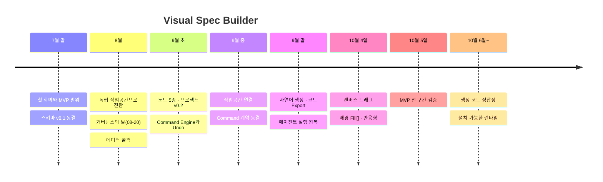

# Visual Spec Builder 제작 연대기

> 다섯 명의 팀이 "화면 스펙을 AI가 구현하도록 통제하는 도구"를 만들어 온 기록이다.
> 2026-07-24 첫 회의부터 2026-10-08까지 커밋 656개, 병합된 PR 163건, 이슈 159건이 쌓였다.
> 단계별 PR·이슈 목록은 [부록](./appendix.md)에, 원본 데이터는 [`data/`](./data/)에 있다.

---

## 한눈에 보기

| 단계 | 기간 | 한 줄 |
|---|---|---|
| **0. 프롤로그 — 한 문장에서 출발하다** | 07-24 ~ 07-31 | 데모 목표 한 문장을 정하고 스키마 v0.1을 동결 |
| **1. 기초 공사 — 방향을 다듬고 규칙을 세우다** | 08-01 ~ 08-20 | 독립 작업공간으로 방향을 굳히고, 하루 만에 CI·스킬·문서 체계를 세움 |
| **2. 에디터의 골격이 서다** | 08-21 ~ 08-31 | 스토어·레이어 트리·캔버스·속성 패널·메뉴바가 하나로 이어짐 |
| **3. 표현의 폭을 넓히다** | 09-01 ~ 09-11 | 노드 5종·여러 페이지 프로젝트, 모든 편집이 Command를 거침 |
| **4. 손에 붙는 편집기, 굳어지는 계약** | 09-12 ~ 09-26 | 피그마에 가까운 조작감, 작업공간 연결, Command 계약 동결 |
| **5. 말이 화면이 되다** | 09-27 ~ 10-02 | 자연어 생성·수정, 코드 ZIP 내보내기, 에이전트 실행 왕복 |
| **6. 몰아친 하루 — 배경과 반응형** | 10-03 ~ 10-04 | 캔버스 드래그, 채우기 겹 배경(v0.3), 반응형 스키마가 하루에 |
| **7. 첫 완주** | 10-05 | 이미지 배경과 실행 정책을 마무리하고, 설치부터 Export까지 전 구간 통과 |
| **8. 제품으로 다듬다** | 10-06 ~ | 생성 코드 정합성, 편집 안정성, 설치 가능한 런타임 |

---

## 함께 만든 사람들

| GitHub | 이름 | 기록에서 드러난 주 영역 |
|---|---|---|
| [Yumesa2025](https://github.com/Yumesa2025) | 김태환 | 기획·통합, 스키마 v0.1, 문서·CI·기여 규칙, GUI와 작업공간 연결, 배경 채우기·반응형·이미지 배경 |
| [GAMMJ](https://github.com/GAMMJ) | 김민재 | 공유 스토어, 캔버스, 속성 패널, 스키마 v0.2, 반응형 설계, 설치 가능한 런타임 |
| [wook3964](https://github.com/wook3964) | 박용욱 | React 코드 생성 스킬, Command Engine과 Undo, Ticket 스키마, CLI, 자연어 생성 |
| [dogui1018](https://github.com/dogui1018) | 김도국 | 메뉴바와 File 메뉴, 레이어 트리, 단축키, 검증 관문(G2·G3), 티켓 실행 왕복, 홈 자연어 초안 |
| [SunMyunC](https://github.com/SunMyunC) | 정선영 | 디자인 토큰과 테마, 피그마식 UI 골격, 하단 도구 모음, GUI 회의 정리 |

본문에서는 GitHub 핸들로 부른다.

---

## 0. 프롤로그 — 한 문장에서 출발하다

`07-24 ~ 07-31`

2026년 7월 24일 금요일, 다섯 명이 첫 회의에서 네 가지를 정했다. MVP 범위, 데모 시나리오, 첫 스키마 초안, 그리고 역할 분담이다. 관객에게 보여줄 데모 목표는 이 한 문장으로 모였다.

> **화면 스펙을 컴포넌트 구현 티켓으로 변환하고, Claude Code와 Codex가 의존성 순서에 따라 구현·검증하도록 통제하는 Visual Implementation Harness.**

이 문장이 이후 석 달 동안의 북극성이 됐다. 다만 첫 그림은 지금과 꽤 달랐다. 첫 PRD는 사용자가 **기존 React 프로젝트에 라이브러리를 설치**하면 CLI가 컴포넌트와 스타일 구조를 분석하고, 생성된 React 화면을 **미리보기 서버에서 캔버스와 나란히 비교**하는 흐름을 그렸다. 스키마 초안에는 `container`·`section`·`form`·`heading`부터 `checkbox`·`radio`·`listItem`까지 노드 17종이 올라 있었다.

참고 자료도 모았다. 자연어와 캔버스 조작이 같은 내부 명령으로 모이는 openpencil, DOM 요소와 코드를 잇는 onlook, 드래그 엔진인 craft.js와 puck 등을 "자연어·직접조작 → Command Engine → IR Store → Canvas Renderer → Ticket Compiler → Claude Code"라는 PRD 구조에 맞춰 정리했다. 이 구조는 지금의 제품에 거의 그대로 남아 있다.

7월 28일에는 JSON 초안을 일곱 영역(공통 규칙, 스키마 총괄, 스키마와 검증기, 렌더러, 캔버스, 속성·트리 패널, 코드 생성기)으로 나눴다. 7월 30일 GUI 회의에는 다섯 명이 모두 모여 화면을 **상단 메뉴바 · 좌측 레이어 트리 · 중앙 캔버스 · 우측 속성 패널 · 하단 도구창**으로 나눴다. "공통 기반을 먼저 만든 뒤 영역별로 나눈다"는 결정도 이 자리에서 나왔다.

같은 날 저장소에는 개요·GUI 명세·스키마 문서와 함께 **Visual Spec Schema v0.1**의 JSON 스키마와 TypeScript 타입이 들어왔다(#1). 스키마는 곧바로 동결됐다. 무엇이든 바꾸려면 절차를 밟아야 하는 계약이 첫 주에 생긴 것이다.

**핵심 장면**
- 07-24 첫 회의 — MVP 범위, 데모 목표 한 문장, IR 초안, 5인 역할
- 07-28 JSON 초안과 일곱 담당 영역
- 07-30 GUI 5영역 회의(참석: Yumesa2025·dogui1018·GAMMJ·wook3964·SunMyunC)
- 07-30 스키마 v0.1 구현과 동결 (#1)

---

## 1. 기초 공사 — 방향을 다듬고 규칙을 세우다

`08-01 ~ 08-20` · 병합 PR 11 · 커밋 36

8월 초는 손을 풀며 시작했다. GAMMJ가 패키지 관리자를 pnpm으로 옮기고 이슈 템플릿을 붙였고(#4), 에디터 레이아웃 골격을 세웠다(#6). wook3964는 Visual Spec을 React 코드로 바꾸는 첫 에이전트 스킬 초안을 냈다(#9).

이 시기의 가장 큰 사건은 코드가 아니라 **방향**이었다. 기획 단계부터 흔들리던 "기존 프로젝트 분석"과 "React 미리보기"를 8월 15일 문서에서 공식적으로 내려놓았다. 도구는 사용자의 프로젝트를 읽지도, 고치지도 않는다. 대신 `.visual-spec/`이라는 **독립 작업공간** 안에서만 화면을 만들고 완성된 결과만 내보낸다. 범위를 덜어낸 덕분에 MVP를 데모까지 끌고 갈 길이 보였다.

8월 20일은 팀이 **거버넌스의 날**로 기억할 만하다. 하루 저녁에 PR 8건이 연달아 들어왔다.
- 기획 문서를 읽는 순서대로 재편 (#14)
- 타입체크·테스트·스키마 드리프트를 검사하는 CI (#16)
- 에이전트 스킬 번들 6종 (#17)
- "무엇이 되고 무엇이 남았는지"를 적는 구현 현황 문서 07 (#18)
- 기여 규칙과 거버넌스 파일 (#19)

기록으로 보면 이날이 분기점이다. 그 전까지 병합된 PR 12건은 모두 리뷰 승인 없이 들어왔지만, 다음 날부터는 거의 모든 PR이 승인을 받고 들어온다.

---

## 2. 에디터의 골격이 서다

`08-21 ~ 08-31` · 병합 PR 18 · 커밋 80 · 리뷰 승인 18/18

규칙이 서자 다섯 명이 동시에 달렸다. GAMMJ가 **공유 스토어**를 깔았고(#21), SunMyunC가 디자인 토큰과 다크·라이트 테마(#7), 이어서 레이어 트리·툴바·메뉴바·속성 패널로 이뤄진 **피그마식 UI**를 올렸다(#28). GAMMJ가 속성 패널을 스토어에 연결하면서 **캔버스의 임시 구현**을 넣었다(#30). "임시"라고 불린 이 캔버스는 나중에 제품의 중심이 된다.

dogui1018은 메뉴바의 File 메뉴를 차례로 살렸다. View 메뉴(#31), Export(#37), New·Open(#49), Save·Save as(#51), 그리고 Ctrl+휠 줌(#53)까지 이어졌다. wook3964는 코드 생성 스킬을 키웠다. 여러 화면을 한 번에 처리하고(#25), 후속 피드백을 "JSON 수정 → 재생성"으로 반영하고(#27), 컴포넌트 단위로 파일을 나눴다(#36).

8월 28일, 기획에서 내려놓은 "대상 프로젝트 분석" 스킬이 코드에서도 실제로 지워졌다(#34). 문서의 결정이 코드로 확정된 순간이다. 같은 주에 협업 규칙도 5인 팀 구조에 맞게 다시 썼다(#39).

---

## 3. 표현의 폭을 넓히다 — 스키마와 편집 모델

`09-01 ~ 09-11` · 병합 PR 32 · 커밋 116

9월은 스키마를 넓히며 시작했다. dogui1018이 **Image 노드**를 넣었고(#67), wook3964가 **Button·Input 노드와 Grid 레이아웃**을 더했다(#83). 회의 초안의 17종 대신, 필요가 확인된 것만 늘려 **노드 5종 + 레이아웃** 체계가 잡혔다. 그림자·투명도·블러·테두리 정렬로 스타일 표현력도 넓혔다(#88).

가장 큰 변화는 9월 2일 GAMMJ의 **스키마 v0.2**였다(#76). 저장 단위가 "파일 하나에 화면 하나"에서 "파일 하나에 여러 페이지를 담는 프로젝트"로 바뀌었다. 스토어와 캔버스에 활성 페이지 개념이 생겼고(#80), 레이어 트리에 페이지 폴더가 붙었다(#100). wook3964는 화면 목록을 보여주는 **홈 화면**을 만들었다(#77).

편집의 뼈대도 바뀌었다. wook3964가 **Command 타입 5종과 Undo·Redo 스택**을 도입했고(#79), IR을 컴포넌트 구현 단위로 쪼개는 **Ticket 스키마 v0.1**을 냈다(#81). 9월 11일에는 필드 편집까지 Command Engine을 거치도록 고쳐(#102), "모든 편집은 명령이다"라는 원칙이 코드 전체에 자리 잡았다. 같은 날 `visual-spec` CLI가 init·skills·GUI 실행 명령을 갖췄고(#106~#108), Windows에서 CLI가 죽던 문제도 바로잡았다(#117).

---

## 4. 손에 붙는 편집기, 굳어지는 계약

`09-12 ~ 09-26` · 병합 PR 29 · 커밋 90

기능이 갖춰지자 다음은 **손맛**이었다. 레이어 트리 드래그로 다른 프레임에 옮기기(#124), 이어지는 입력을 Undo 한 단계로 합치기(#122·#141), 새로고침해도 작업이 사라지지 않게 하기(#134), 도구 단축키와 스페이스 임시 팬(#137)이 들어왔다. GAMMJ는 커서 기준 줌·중클릭 팬 등 캔버스 조작을 피그마에 맞추고(#164), 간격·거리 표시와 hover 미리보기를 넣고(#165), 커진 `Canvas.tsx`를 네 모듈로 갈랐다(#166).

9월 19일, Yumesa2025가 **GUI를 `.visual-spec/` 작업공간에 연결**했다(#145). 브라우저 편집기와 파일 시스템이 처음으로 직접 이어졌다. 같은 날 자연어 변환 설계안(docs/08)이 나왔다(#144).

이어서 계약들이 굳었다. wook3964가 **Command 스키마를 v0.1로 동결**하고(#168), 구현 티켓을 GUI에서 만들고 보여주는 **티켓 패널 A안**을 붙였다(#169). dogui1018은 AI가 보낸 신뢰할 수 없는 Command 배열을 거르는 **G2·G3 관문**과 "전부 적용하거나 아무것도 적용하지 않는" 커밋 규칙을 만들었다(#176). 자연어를 받아들일 준비가 끝난 것이다.

9월 21일부터 27일까지는 병합이 거의 없는 **소강기**였다. 다음 단계를 준비하는 숨 고르기였다.

---

## 5. 말이 화면이 되다 — 자연어와 코드 생성

`09-27 ~ 10-02` · 병합 PR 14 · 커밋 33

9월 27일, 숨 고르기가 끝나자 마지막 고리들이 한꺼번에 이어졌다. 선택한 요소를 자연어로 고치는 **자연어 부분 수정**(#177)과, 생성된 React 코드를 검증해 결과 폴더를 ZIP으로 내보내는 **코드 Export**(#178)가 같은 날 들어왔다. wook3964는 createNode를 노드 5종으로 넓혀(#191) **자연어로 화면 전체를 만드는** 경로를 증명했다(#192). 에이전트용 응답 스킬 문서도 붙였다(#196).

dogui1018은 티켓 패널에 **에이전트 실행 왕복**을 연결했다(#197, 티켓 B안). GUI에서 티켓을 보내면 에이전트가 구현하고, 결과가 다시 GUI로 돌아온다. GAMMJ는 **Ticket 스키마를 v0.1로 동결**하고(#200), 착수 때 범위에서 뺐던 **반응형**을 다시 꺼내 설계를 결정했다(#202).

이 무렵 "설치 → 화면 구성 → 티켓 → 코드 생성 → Export"에 필요한 길이 모두 갖춰졌다. 남은 일은 그 길을 실제로 걸어 보는 것이었다.

---

## 6. 몰아친 하루 — 배경과 반응형

`10-03 ~ 10-04` · 병합 PR 24 · **커밋 142**

10월 4일은 이 프로젝트에서 가장 밀도 높은 하루다. 커밋 142개는 그 전 열흘 치를 합친 것보다 많다.

아침에는 캔버스 위에서 노드를 직접 끌어 형제 순서와 부모를 바꾸는 기능이 들어왔다(#206). 리사이즈 한 번이 Undo 한 단계가 되게 하고, 값이 그대로인 입력은 Undo 기록을 남기지 않게 고쳤다(#208·#210).

이어서 배경이 바뀌었다. 단색 하나이던 배경을 그라디언트와 여러 겹을 쌓는 **채우기 겹 배열(Fill[])**로 넓히고 문서 버전을 **0.3**으로 올렸다. 설계(#211), 스키마 전환(#212), 캔버스 렌더(#213), 편집기(#214), 스킬과 문서(#215), 예제(#216)까지 한 기능을 다섯 단계로 나눠 하루에 끝냈다.

저녁 6시에는 MVP까지 남은 일을 이슈 20건으로 쪼개 한꺼번에 등록했다. 그날 밤 그중 상당수가 병합됐다.
- GUI 티켓 응답 스킬과 프로토콜 예제 검증 (#237)
- 단일 노드 그룹 만들기·해제 (#250)
- 반응형 선택 스키마와 누적 override 검증, 반응형 코드 생성 지침 (#245·#248)
- 홈 프로젝트를 최근 수정순으로 정렬 (#244)
- 빈 Undo, 알림 없는 Export, 잘못된 색상 입력 개선 (#240)

---

## 7. 첫 완주 — MVP 전 구간 검증

`10-05` · 병합 PR 13 · 이슈 29건 등록

10월 5일에는 남은 퍼즐을 맞췄다.
- 반응형 미리보기와 상속 override 편집 (#247)
- **이미지 배경** 스키마·편집·렌더·자산 Export (#254·#257)
- 삽입 메뉴에서 Button·Input 직접 생성 (#256)
- 여러 탭에서 저장이 충돌하면 멈추고 초안을 보존 (#258)
- 홈 프로젝트 이름과 파일명 동기화 (#259)

임시라고 불리던 캔버스는 렌더링·선택·드래그 역할로 나뉜 **정식 구현**이 됐다(#255).

에이전트 실행 방식도 정리됐다. 도구가 에이전트를 대신 띄우는 대신, **사용자가 직접 에이전트를 실행**하고 도구는 파일로 주고받는 정책으로 확정했다(#253).

그리고 저녁 8시 무렵, **실제 에이전트(Codex)로 MVP 전체 흐름을 검증한 결과**가 기록됐다(#261). 설치부터 화면 구성, 티켓, 코드 생성, Export까지 7월 24일에 적은 그 한 문장이 처음으로 끝까지 실행된 날이다.

같은 날 다음 일감 29건이 이슈로 등록됐다. 첫 완주는 끝이 아니라 출발선이었다.

---

## 8. 제품으로 다듬다

`10-06 ~ 진행 중` · 병합 PR 21 · 리뷰 승인 21/21

첫 완주 뒤의 과제는 "돌아간다"를 "믿고 쓸 수 있다"로 바꾸는 일이었다. 10월 6일 이슈·PR 제목과 라벨 규칙을 정한 뒤(#266), 팀원들이 영역을 나눠 다듬기 시작했다. 이 기간의 PR은 모두 리뷰 승인을 거쳐 병합됐다.

- **wook3964**: 낡은 티켓 실행 차단(#295), 미저장 초안 보존(#294), 여러 탭의 자연어 요청 경합 방지(#296), 스킬 설치 계약(#298), 그리고 **에이전트 대화에서 일어난 편집을 열린 GUI에 실시간 반영**(#303·#309)
- **GAMMJ**: 코드 생성 결과를 캔버스와 맞추는 정합성 작업(#299·#304·#305·#308·#310), 그리고 **설치 가능한 GUI 런타임 패키지**(#320)
- **dogui1018**: 접근성(#301·#306), 단계 안내(#307), 홈의 자연어 초안 패널(#312), 좌우 패널 접기와 폭 조절(#321)

지금 팀은 성능 측정과 함께 **화면 사이의 관계**(모달·위젯·화면 이동)를 스키마로 표현하는 다음 큰 줄기(#265)를 준비하고 있다.

---

## 바뀐 것들

석 달 동안 처음 계획에서 방향을 튼 결정은 열 가지다.

| 무엇이 | 처음 | 지금 | 언제 |
|---|---|---|---|
| 작업 대상 | 기존 React 프로젝트에 설치해 구조 분석 | 프로젝트를 건드리지 않는 독립 작업공간 | 07-30 기획 → 08-15 문서 → 08-28 코드(#34) |
| 결과 확인 | React Preview로 캔버스와 비교 | MVP에서 제외 | 07-30 기획 → 08-15 문서 |
| 노드 타입 | 회의 초안 17종 | 5종 + 레이아웃 | 09-01(#67) · 09-04(#83) |
| 저장 단위 | 파일 하나에 화면 하나 | 여러 페이지를 담는 프로젝트(v0.2) | 09-02(#76) |
| 배경 | 단색 하나 | 그라디언트·이미지를 겹치는 Fill | 10-04(#212~#216) · 10-05(#257) |
| 반응형 | 착수 때 제외 | MVP에 포함 | 10-01 설계(#202) → 10-04~05 구현 |
| 에이전트 실행 | 티켓 표시만(A안) | 실행 왕복(B안) → 사용자가 직접 실행 | 09-20(#169) → 09-29(#197) → 10-05(#253) |
| 설치 | `npm install` 한 줄 | 저장소 클론 → 설치 가능한 tarball | 09-18 정정 → 10-08(#320) |
| Canvas | 임시 구현 | 역할을 나눈 정식 구현 | 08-25(#30) → 09-20(#166) → 10-05(#255) |
| 병합 방식 | 리뷰 승인 후 병합 | 관리자 병합 집중 → 다시 승인 후 병합 | 10-04~05 → 10-06~ |

같은 데이터가 [`data/pivots.json`](./data/pivots.json)에 각 결정의 이유와 함께 있다.

---

## 만들어 온 원칙

석 달 동안 기능은 계속 바뀌었지만, 만드는 방식에는 일관된 원칙이 몇 가지 있었다.

**스키마는 계약이다.** 첫 주에 스키마 v0.1을 동결한 뒤로, 스키마·Command·Ticket은 모두 버전을 붙여 고정하고 바꿀 때는 별도 문서와 절차를 거쳤다. v0.2(프로젝트)와 v0.3(채우기 겹)도 이전 문서를 읽을 수 있게 하면서 넓혔다.

**모든 편집은 명령이다.** 캔버스 조작, 속성 패널, 레이어 트리, 자연어 요청이 모두 같은 Command를 거쳐 문서를 바꾼다. 그래서 어떤 방식으로 고쳐도 Undo 한 번으로 되돌릴 수 있고, 외부에서 들어온 명령은 G2·G3 관문에서 한꺼번에 검증된다.

**덜어내서 끝까지 간다.** 기존 프로젝트 분석, React 미리보기, 세부 반응형처럼 매력적이지만 데모까지의 길을 막는 것은 과감히 뺐다. 반응형처럼 꼭 필요해진 것은 나중에 설계부터 다시 들였다.

**문서가 현실을 따라간다.** 구현 현황 문서(07)는 "무엇이 되고 무엇이 남았는지"를 실제 코드로 다시 재어 고쳐 왔고, 설계 문서에는 정정 이력을 남겼다. 설치 방법이 "npm 한 줄"에서 "저장소 클론"으로 정정된 것도 문서가 현실을 따라잡은 예다.

---

## 이 기록에 대하여

- **출처**: GitHub 커밋·PR·이슈·리뷰 기록, 저장소 `docs/`의 정정 이력, ClickUp 기획 문서와 회의록(07-24 ~ 07-30, 초기분만)
- **갱신(준비 중)**: PR이 병합될 때마다 [`data/events.json`](./data/events.json)에 사건을 자동으로 추가하고, 주 1회 그 주의 이야기를 PR로 올려 검토 후 병합할 예정이다
- **구성**: 이 문서(이야기) · [부록](./appendix.md)(단계별 PR 목록과 집계) · [`data/`](./data/)(사이트와 자동화가 함께 읽는 JSON)

*마지막 갱신: 2026-10-08*
